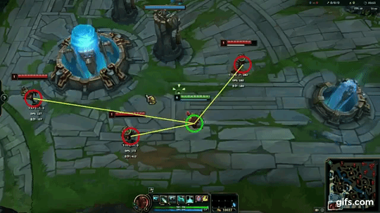

# league-of-legends

### Features
- Enemy finder
- Local Player finder
- Aim-Lock
- Moviment Predictor (simple)
- GDI Overlay (out-game)
- Calculation of position for evasion

### TODOS
[ ] Implements the evade functionality
[ ] Adjust the evade distance angle based on enemy distance
[ ] Fix the moviment predictor when you switch the enemy 

### Demo
https://www.youtube.com/watch?v=dRQHbZ8_4GU

